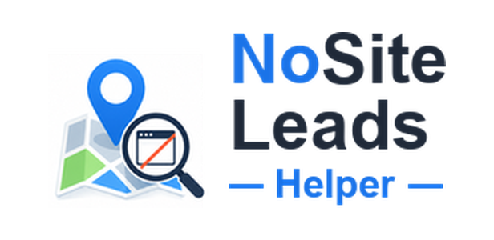
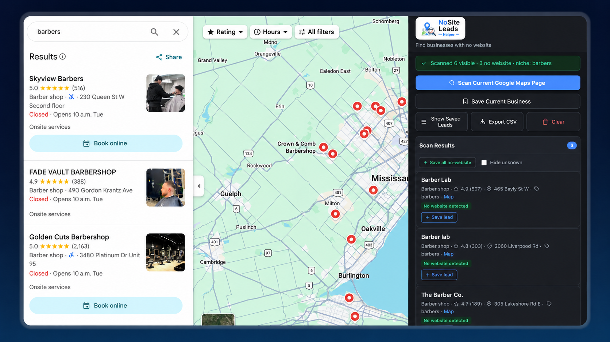
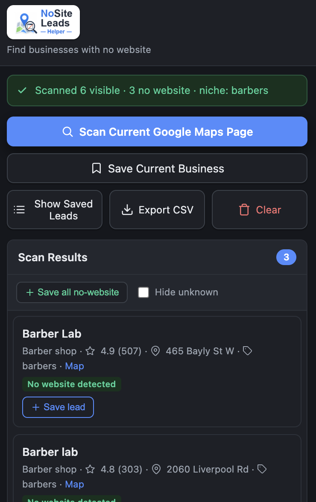

<p align="center">
  
</p>

<h1 align="center">NoSite Leads Helper</h1>

<p align="center">
  Find Google Maps businesses that appear to have <strong>no website</strong>, save them as outreach leads, and export them to CSV — all from a local-only Chrome extension.
</p>

<p align="center">
  
  
  
  
</p>

<p align="center">
  
</p>

---

## Why this exists

Small businesses without websites are strong prospects for web designers, agencies, and local service sellers. **NoSite Leads Helper** makes that prospecting workflow faster without turning it into a scraping bot.

You browse Google Maps normally, scan only the businesses currently visible on the page, save useful leads, add notes/statuses, and export your list when you are ready.

---

## What it does

- Scans the visible Google Maps results on the page you opened
- Flags businesses where no website button or external website link is detected
- Saves leads locally in your browser
- Lets you add notes and outreach statuses
- Prevents duplicate saves
- Exports saved leads to CSV
- Runs without a backend, account, analytics, or paid API key

> **Important:** “No website detected” means the extension did not find a website in the visible Google Maps data. It is a lead signal, not a guarantee. Always verify important leads manually before outreach.

---

## Scan results

<p align="center">
  
</p>

After scanning, the popup shows the businesses where no website was detected, along with useful lead details such as business name, category, rating, reviews, address, niche, city, and map link.

From the popup you can save one result, save all no-website results, hide uncertain matches, open your saved leads, clear local data, or export everything to CSV.

---

## Core features

| Feature | What it does |
| --- | --- |
| **Scan current Maps page** | Checks the Google Maps business results currently visible in your browser. |
| **No-website detection** | Looks for website buttons, external links, and website-related labels. |
| **Save current business** | Saves the open business detail panel for a more precise single-lead capture. |
| **Save all no-website** | Bulk-saves every detected no-website result from the current scan. |
| **Saved lead manager** | View saved leads, search, filter, update status, and add notes. |
| **Duplicate protection** | Marks already-saved businesses so you do not add the same lead twice. |
| **CSV export** | Downloads your saved leads as a spreadsheet. |
| **Local-only storage** | Stores data in `chrome.storage.local` on your own browser. |

---

## Lead data captured

Saved leads can include:

```text
name · category · rating · reviews · address · phone · mapsUrl · websiteStatus · niche · city · notes · status · dateAdded
```

Lead statuses:

```text
Not Called · No Answer · Interested · Sent Mockup · Follow Up · Closed · Not Interested
```

Website status values:

| Status | Meaning |
| --- | --- |
| **No website detected** | No external website button/link was found in the visible Maps data. |
| **Website found** | A website button or external website link was detected. |
| **Website unknown** | Google Maps did not expose enough information to be certain. |

---

## Install locally

1. Download or clone this repository.
2. Open Chrome and go to `chrome://extensions`.
3. Turn on **Developer mode**.
4. Click **Load unpacked**.
5. Select the project folder containing `manifest.json`.
6. Pin **NoSite Leads Helper** to your Chrome toolbar.

---

## How to use

### Find leads from a Google Maps results page

1. Search Google Maps for a niche and location, for example `barbers Kitchener`.
2. Scroll to the bottom of the results list on the left to load all results before scanning.
3. Open the extension.
4. Click **Scan Current Google Maps Page**.
5. Click **Save all no-website** or save individual leads.

> **Tip:** For best results, scroll down the left-hand results list until it stops loading more businesses, then run the scan. The extension only reads the results currently loaded on the page, so loading the full list first captures more leads in a single scan.

### Save one specific business

1. Click a business on Google Maps to open its detail panel.
2. Open the extension.
3. Click **Save Current Business**.

### Manage and export leads

1. Click **Show Saved Leads**.
2. Add notes and update each lead’s status.
3. Use search and filters to organize your list.
4. Click **Export CSV** to download your leads.

---

## Project structure

| File / folder | Purpose |
| --- | --- |
| `manifest.json` | Chrome Manifest V3 configuration. |
| `popup.html` | Extension popup markup. |
| `popup.css` | Popup styling. |
| `popup.js` | Popup logic, local storage, saved leads, and CSV export. |
| `content.js` | Google Maps scanner and business data extraction. |
| `icons/` | Extension icons and README branding. |
| `docs/images/` | README screenshots. |

---

## How detection works

Google Maps markup changes often, so detection is best-effort. The extension checks the visible page for signals such as:

- website buttons and links
- website-related labels such as `Website`
- external URLs that are not Google Maps links
- business names, categories, ratings, review counts, addresses, and phone patterns

If results look wrong, Google may have changed its page structure. The detection logic is kept in `content.js` so selectors and fallbacks can be updated in one place.

---

## Privacy

NoSite Leads Helper is private by default.

- No backend
- No account required
- No analytics
- No paid API keys
- No third-party lead database
- Saved leads stay in your browser using `chrome.storage.local`

Use **Export CSV** before uninstalling the extension or clearing browser data.

---

## Scope

This is a manual productivity helper. It only inspects the Google Maps page you opened yourself and the results currently visible in your browser.

It does **not**:

- auto-scroll endlessly
- bypass logins or CAPTCHAs
- use a paid Google Maps API
- send lead data to a server
- run as a background scraping service

---

## Notes for public release

Google Maps data and Chrome extension distribution may be subject to platform terms and policies. Review the relevant terms before publishing this extension publicly or using it commercially.
